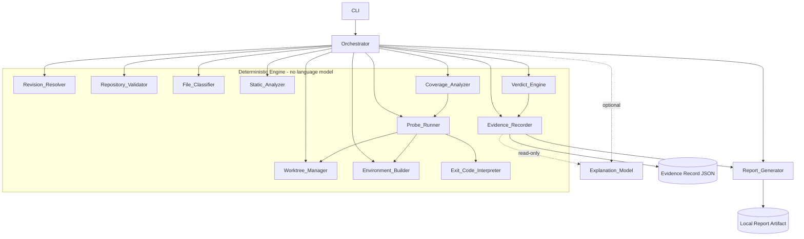
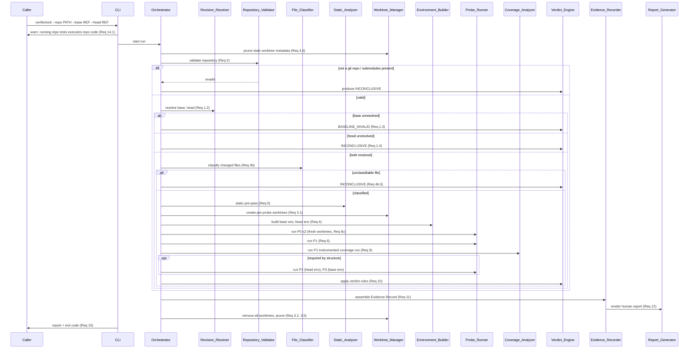

# Design Document

## Overview

VerifierLock is a local command-line tool that answers a single question about a
Git change in a Python/pytest repository: **does the change have independent
test evidence, or did it weaken its own verifier?** It treats the base revision
as a reference implementation and the base→head diff as a mutant (the inversion
of mutation testing), then runs a four-probe matrix to observe whether the head
test suite can distinguish base behaviour from head behaviour.

The design is organized around one non-negotiable principle carried over from
the requirements and the decision log: **mechanism is separated from
interpretation**. A deterministic engine performs every step that feeds a
verdict — revision resolution, repository validation, worktree management,
environment construction, file classification, static analysis, probe
execution, exit-code interpretation, coverage mapping, verdict rules, and
evidence capture. No language model participates in that path. Identical inputs
produce an identical verdict and identical probe-outcome fields (Requirements
10.16, 11.5, 13.1). An optional Explanation_Model may narrate a finished
Evidence Record but can never create, change, suppress, or override a verdict
(Requirement 13.2).

The tool produces exactly one of seven verdicts per run
(INDEPENDENT_EVIDENCE, NO_INDEPENDENT_EVIDENCE, NO_VERIFIER_CHANGE,
VERIFIER_WEAKENED, VERIFIER_CHANGED_REVIEW_REQUIRED, INCONCLUSIVE,
BASELINE_INVALID), a machine-readable Evidence Record (JSON), a human-readable
report, and a process exit code that reflects the verdict.

### Design Goals Traceability

| Goal | Requirements |
|---|---|
| Deterministic, model-free verdict | 10.16, 13.1, 13.3 |
| Reproducible, auditable evidence | 11.1–11.5 |
| Crash-safe isolation between probes | 3.2, 3.5, 3.6 |
| Precise pytest exit-code semantics | 8.1–8.7 |
| Trustworthy baseline before any verdict | 8b.1, 8b.2, 8c.1–8c.3 |
| Local-only, warned execution | 14.1–14.3 |
| Scriptable exit codes | 15.1–15.9 |

## Architecture

### High-Level Structure

VerifierLock is a single Python package invoked as a CLI. A central
**Orchestrator** drives a fixed pipeline. Each stage is an independent,
individually testable component with a pure-function core wherever the logic is
deterministic (classification, exit-code interpretation, coverage mapping,
verdict rules). Side-effecting components (worktree, environment, probe process
execution) are isolated behind narrow interfaces so their pure counterparts can
be property-tested with generated inputs.

The pipeline short-circuits: several pre-probe conditions produce a verdict
without executing any probe (Requirements 1.3, 1.4, 2.2, 2.3, 4b.5), satisfying
the requirement that the Probe_Runner SHALL NOT execute any probe in those
cases.

### Component Diagram



The dashed edge to Explanation_Model is the only path that touches a language
model, it reads a finished Evidence Record and writes prose only. It is outside
the deterministic engine boundary and has no edge back into Verdict_Engine
(Requirement 13.2).

### End-to-End Sequence (single run)



### Determinism Controls

Every probe (P0 repetitions, P1, P2, P3, and the P1 coverage run) is launched
through one shared command-composition function so the controls cannot drift
between probes. The controls, mapped to Requirement 7:

| Control | Mechanism | Req |
|---|---|---|
| Disable cache provider | `-p no:cacheprovider` | 7.1 |
| Disable random ordering | do not load `pytest-randomly`; `-p no:randomly` if present | 7.2 |
| Neutralise repo addopts | `-o addopts=""` (override, empty) | 7.3 |
| Fixed hash seed | env `PYTHONHASHSEED=0` | 7.4 |
| No bytecode writing | env `PYTHONDONTWRITEBYTECODE=1` + `-p no:cacheprovider` | 7.4 |
| Fixed rootdir | `--rootdir=<worktree>` | 7.5 |
| Import mode | `--import-mode=importlib` | 6.2 |
| Purge bytecode before | delete `__pycache__`/`.pytest_cache` before launch | 7.6 |
| Purge bytecode after | delete same after completion or termination | 7.7 |

Because `-o addopts=""` neutralises addopts, coverage must be re-introduced
deliberately for the P1 coverage run only (see Concern 2 below).

## Components and Interfaces

Interfaces are shown as Python type signatures. Data classes are frozen
(immutable) so that the same inputs cannot be mutated between stages, protecting
determinism.

### CLI

```python
def main(argv: list[str]) -> int:
    """Parse args, print the untrusted-code warning (Req 14.1),
    invoke the Orchestrator, print the report, return the exit code (Req 15)."""
```

- Accepts `--repo PATH --base REF --head REF`, plus `--timeout SECONDS`
  (Req 7b.1), `--explain/--no-explain` (default off, Req 13), `--json PATH`,
  `--report PATH`, `--install-cmd "<cmd>"` (dependency-install override; must
  install dependencies only and must not install the project package, see
  Concern 3), and `--strict` (CI gating policy; controls which verdicts are
  build-blocking without changing the documented exit-code mapping, see the
  Verdict-to-Exit-Code Mapping section).
- Prints the warning that running tests executes repository code with the
  caller's privileges before any probe (Req 14.1).
- Maps the final verdict to the documented exit code (Req 15). If the run
  aborted on pytest exit code 2 with no verdict, returns the distinct
  "aborted, no verdict" code (Req 8.4, 15.9).

### Revision_Resolver

```python
@dataclass(frozen=True)
class ResolvedRevisions:
    base_hash: str | None
    head_hash: str | None
    base_error: str | None
    head_error: str | None

def resolve(repo: Path, base_ref: str, head_ref: str) -> ResolvedRevisions:
    """git rev-parse each ref to a full commit hash (Req 1.2)."""
```

- Base unresolved → orchestrator produces BASELINE_INVALID with reason code
  `BASELINE_REF_UNRESOLVED`, no probe runs (Req 1.3).
- Head unresolved → INCONCLUSIVE, no probe runs (Req 1.4).
- On success, both hashes recorded (Req 1.5).

### Repository_Validator

```python
@dataclass(frozen=True)
class RepoValidation:
    is_git_repo: bool
    has_submodules: bool
    determination: str  # "supported" | "not_a_git_repo" | "has_submodules"

def validate(repo: Path) -> RepoValidation:
    """Confirm a Git repo and reject submodules before any probe (Req 2.1-2.3)."""
```

- Not a Git repo or has submodules → INCONCLUSIVE, no probe runs (Req 2.2, 2.3).
- Determination recorded (Req 2.4). Submodules are unsupported by design
  (decision log 4.2, worktree submodule support incomplete).

### Worktree_Manager

```python
@dataclass(frozen=True)
class WorktreeHandle:
    probe_slot: str        # e.g. "p0-rep0", "p2"
    commit_hash: str
    path: Path

class Worktree_Manager:
    def prune_stale(self) -> None: ...            # Req 3.6, run at start
    def create(self, slot: str, commit: str) -> WorktreeHandle: ...  # Req 3.1
    def remove_all(self) -> None: ...             # Req 3.2, 3.5, crash-safe
```

- Uses `git worktree add --detach <unique-path> <commit>` (Req 3.1). Never
  `--force`; uniqueness is guaranteed by the path scheme (Concern 1).
- All handles are removed on any termination via a context manager / `finally`
  and signal handlers, then metadata is pruned (Req 3.2, 3.5).
- Stale metadata is pruned at run start so a leaked worktree from a crashed
  prior run cannot hold a ref (Req 3.6, decision log 4.2).
- Creation failure for a revision → the Probe_Runner reports INCONCLUSIVE for
  each probe depending on that worktree (Req 3.3).
- Each worktree path is recorded per probe (Req 3.4).

#### Concern 1 — Worktree collision scheme (design decision)

`git worktree add --detach` refuses to check out a commit that is already
checked out in another worktree unless `--force` is passed. A single run needs
multiple worktrees, and several may target the **same** commit:

- P0 runs at least twice, each in a **fresh** worktree at the base commit
  (Req 8c.1, 8c.3) — two worktrees, same base commit.
- P2 composes base source + head tests → a worktree at the **base** commit.
- P3 composes head source + base tests → a worktree at the **head** commit.
- P1 (and its coverage run) uses a worktree at the head commit.

So the base commit is targeted by P0-rep0, P0-rep1, and P2; the head commit by
P1 and P3. Relying on `--force` would defeat the isolation guarantee: `--force`
lets two worktrees share a checked-out commit, and the whole point of fresh
worktrees is that side effects from one execution cannot contaminate another
(Req 8c.3, 3.1). We therefore give **every probe slot its own unique worktree
path** and never force.

**Naming scheme.** All worktrees for a run live under a single per-run temp
directory so cleanup is a single subtree removal:

```
<system-temp>/verifierlock/<run-id>/worktrees/<slot>/
```

where `<run-id>` is a UUID4 generated once per run, and `<slot>` is the probe
slot identifier, keyed by **probe id and, for P0, the repetition index**:

| Slot directory | Checked-out commit | Purpose |
|---|---|---|
| `p0-rep0` | base | first baseline repetition |
| `p0-rep1` | base | second baseline repetition |
| `p0-rep{n}` | base | nth repetition if configured |
| `p1`        | head | head-as-submitted probe + coverage run |
| `p2`        | base | base source + grafted head tests |
| `p3`        | head | head source + grafted base tests |

Concrete example for run id `a1b2`:

```
/tmp/verifierlock/a1b2/worktrees/p0-rep0/   # git worktree add --detach ... <base>
/tmp/verifierlock/a1b2/worktrees/p0-rep1/   # git worktree add --detach ... <base>
/tmp/verifierlock/a1b2/worktrees/p1/        # ... <head>
/tmp/verifierlock/a1b2/worktrees/p2/        # ... <base>
/tmp/verifierlock/a1b2/worktrees/p3/        # ... <head>
```

Because each path is distinct, `git worktree add` never sees the same commit
checked out at the same path, and it never needs `--force`, even though
`p0-rep0`, `p0-rep1`, and `p2` all point at the base commit. Cleanup removes the
`<run-id>` subtree and runs `git worktree prune` (Req 3.2, 3.5). Test grafting
(copying head tests into `p2`, base tests into `p3`) happens **inside** these
worktrees and never touches the caller's working tree.

### Environment_Builder

```python
@dataclass(frozen=True)
class BuiltEnv:
    revision: str          # "base" | "head"
    tool: str              # "uv" | "venv+pip"
    python_path: Path      # interpreter to launch pytest with
    discovery: str         # which dependency source was used
    installed_project: bool  # always False — project package is never installed
    install_kind: str        # "deps_only" (see Concern 3)
    error: str | None      # populated on failure

class Environment_Builder:
    def build(self, worktree: WorktreeHandle, revision: str) -> BuiltEnv: ...
```

- Prefers `uv` when available, else `venv` + `pip` (Req 4.1, 4.2). The chosen
  tool is recorded (Req 4.3).
- Installs **third-party dependencies only**; it never installs the project
  package under test into site-packages (see Concern 3). This is what makes it
  safe to run one revision's source under another revision's environment.
- P2 uses the **head** environment; P3 uses the **base** environment — the
  environment follows the tests, not the source (Req 4.4, 4.8, decision log
  4.5). Because the package is not installed, the source that runs is the
  worktree source, not an installed copy.
- Import/collection failure of the other revision's source under this
  environment → `ENV_INCOMPATIBLE` → INCONCLUSIVE for that probe (Req 4.5, 4.7).
  A *test failure* is never ENV_INCOMPATIBLE; it is classified per Requirement 8
  (Req 4.6, 4.7).

#### Concern 3 — Dependency discovery (design decision)

Environment_Builder must learn each revision's dependencies from the checked-out
worktree. Discovery is **per revision** (base and head may differ) and uses a
fixed precedence so the choice is deterministic and recorded.

##### Dependencies only — never install the project package under test

**Environments install third-party dependencies ONLY. The project package under
test is NEVER installed into site-packages, because P2 and P3 run one revision's
source with another revision's environment; an installed copy would shadow the
worktree source and cause the probe to execute the wrong source.**

This is a correctness requirement, not an optimisation. P2 runs **base** source
on disk under the **head** environment (Req 4.4), and P3 runs **head** source on
disk under the **base** environment (Req 4.8). If the project package were
installed into site-packages, a test's `import authpkg` could resolve to the
installed copy instead of the worktree source. P2 would then execute HEAD source
instead of BASE source — silently defeating the entire discrimination mechanism
and making VERIFIER_WEAKENED unreachable or wrong. Because base and head
worktrees for a run share the same site-packages resolution surface, installing
either revision's package would corrupt the other probe. Therefore no revision's
package is ever installed; only its declared third-party dependencies are.

##### Per-revision, dependency-only install scheme

| Order | Source detected in worktree | How **dependencies only** are installed |
|---|---|---|
| 1 | Explicit `--install-cmd "<cmd>"` CLI flag | Run the declared command verbatim; the caller is responsible for ensuring it installs dependencies only and does NOT install the project package (see constraint below) |
| 2 | `pyproject.toml` with a build backend / `[project]` deps | Install resolved dependencies ONLY — e.g. `uv pip install --only-deps .` (or export the resolved dependency set and install it); include `[project.optional-dependencies]` test/dev extras if declared. Do **not** run `uv pip install .` / `pip install .` |
| 3 | `requirements.txt` (and `requirements-dev.txt`/`test` if present) | `uv pip install -r requirements.txt` (+ dev/test files) — a requirements file lists dependencies, not the project, so this installs deps only |
| 4 | `setup.py` (no pyproject) | Parse/resolve declared dependencies (`install_requires`/`tests_require`/extras) and install those only; do **not** run `pip install .` |
| 5 | none of the above | **INCONCLUSIVE**, reason code `DEPS_UNDISCOVERABLE` |

**`--install-cmd` constraint.** When the caller overrides discovery, the declared
command must install dependencies only and must not install the project package
under test (no `pip install .`, `pip install -e .`, `python setup.py install`,
etc.). This constraint is documented for the flag and surfaced in the report;
VerifierLock cannot fully police an arbitrary command, so honouring it is the
caller's responsibility.

**Provisional `uv` command for the `pyproject.toml` path (verify at
implementation).** The exact deps-only command shown for order 2,
`uv pip install --only-deps .`, is **PROVISIONAL** and must be verified during
implementation: that flag may not exist as named. Acceptable concrete approaches
to select from at implementation time include using `uv pip compile` to resolve
the dependency set and then installing the resolved set, or installing the
project and then uninstalling only the project package so that just its
dependencies remain. The `requirements.txt` path (order 3) and the
`--install-cmd` path (order 1) are already clean and need no such verification.
The **design intent is fixed and unambiguous** — install the revision's
third-party dependencies only, and never install the project package under test;
only the exact `pyproject.toml` command is to be selected and verified at
implementation time, and that selection must not weaken the dependency-only
guarantee.

Precedence rationale: a caller-declared command is the most authoritative and
overrides inference (open question 1 in the decision log). `pyproject.toml` is
the modern standard and is preferred over `requirements.txt` when both exist,
because it declares extras and lets us resolve the full dependency set. `setup.py`
is the legacy fallback. The detected source is written to `BuiltEnv.discovery`
and into the Evidence Record per revision.

##### Import resolution — worktree source must win

Because the project package is deliberately absent from site-packages, the probe
must resolve `import <project>` to the on-disk worktree source, and it must do so
even if a stray copy is present. The probe is launched with the worktree source
ahead of site-packages:

- `PYTHONPATH` is set to the worktree root (and its `src/` directory when a
  src-layout is detected), so the worktree source is first on the import path.
- Every probe already passes `--rootdir=<worktree>` and
  `--import-mode=importlib` (determinism controls); together with the
  `PYTHONPATH` ordering these ensure the on-disk worktree source always wins over
  anything that might exist in site-packages.

This closes the shadowing gap end-to-end: dependency-only installs keep the
package out of site-packages, and import resolution guarantees the worktree copy
is the one that loads.

**When nothing is found:** the environment for that revision cannot be built
deterministically, so the probes depending on it cannot run. This maps to
INCONCLUSIVE (never BASELINE_INVALID), because we could not *assess* the
baseline rather than assessing it and finding it unstable — consistent with the
decision-log treatment of un-assessable baselines and with Requirement 4's
intent that probe results reflect real behaviour rather than dependency
mismatches. If the **base** environment cannot be built, P0 is INCONCLUSIVE and,
by the precedence in Requirement 10, the run resolves to INCONCLUSIVE (not
BASELINE_INVALID, since P0 was never validly assessed). The reason code
`DEPS_UNDISCOVERABLE` names the revision and the searched paths, and the
`DEPS_UNDISCOVERABLE` fallthrough remains INCONCLUSIVE.

### File_Classifier

```python
class FileClass(Enum):
    PRODUCTION = "production"
    TEST = "test"
    VERIFIER_CONFIG = "verifier_config"

@dataclass(frozen=True)
class ClassifiedFile:
    path: str
    classification: FileClass

@dataclass(frozen=True)
class ClassificationResult:
    files: tuple[ClassifiedFile, ...]
    unclassifiable: tuple[str, ...]

def classify(diff: Diff, pytest_config: PytestConfig) -> ClassificationResult:
    ...
```

- Classifies every changed file as production source, test code, or verifier
  configuration (Req 4b.1).
- Uses declared `testpaths` when present, else pytest default discovery patterns
  and `conftest.py` (Req 4b.2, 4b.3).
- Verifier configuration includes CI workflow files, coverage config, pytest
  config, lint config, type-check config (Req 4b.4).
- Any unclassifiable file → orchestrator produces INCONCLUSIVE citing the path,
  before any probe (Req 4b.5). Classification runs before probe execution and
  short-circuits (decision log open question 3).
- Every classification recorded (Req 4b.6).

The classification also drives probe selection: P2 and P3 are **required** only
when at least one changed file is production source AND at least one is test
code or verifier configuration (Glossary "Required probe", Req 10.14, 10.15).

### Static_Analyzer

```python
@dataclass(frozen=True)
class StaticFinding:
    kind: str          # e.g. "deleted_assertion", "new_skip", "lowered_fail_under"
    file: str
    hunk: str          # location within the file
    detail: str

def analyze(diff: Diff,
            base_node_ids: frozenset[str],
            head_node_ids: frozenset[str]) -> tuple[StaticFinding, ...]:
    ...
```

- Inspects the diff without executing repository code for: deleted/weakened
  assertions; newly skipped/xfailed/deselected tests; new coverage exclusions;
  lowered `fail_under`; disabled lint/type checking; `continue-on-error` CI
  weakening; fixtures that remove a failing condition; changed
  success-reporting commands (Req 5.1, 5.2, 5.4).
- Detects reduced test selection by comparing base vs head collected node-ID
  sets (Req 5.3).
- Records each finding with file and hunk location (Req 5.5).
- Findings **raise suspicion and inform probe selection only**; they can never
  by themselves produce VERIFIER_WEAKENED (Req 5.6). This is enforced in the
  Verdict_Engine, which reads probe outcomes, not findings, for that verdict.

### Probe_Runner and Exit_Code_Interpreter

```python
class ProbeOutcome(Enum):
    ALL_PASSED = "all_passed"
    TESTS_FAILED = "tests_failed"
    INCONCLUSIVE = "inconclusive"

@dataclass(frozen=True)
class ProbeResult:
    probe_id: str          # "P0", "P1", "P2", "P3"
    repetition: int        # 0 for non-P0 / first P0
    command: tuple[str, ...]
    exit_code: int | None  # None if terminated (timeout)
    outcome: ProbeOutcome
    collected: int
    passed: int
    failed: int
    skipped: int
    elapsed_seconds: float
    reason: str | None     # reason code + detail for INCONCLUSIVE
    worktree_path: str

def interpret_exit_code(code: int) -> tuple[ProbeOutcome, str | None]:
    """Pure mapping of pytest exit codes to outcomes (Req 8)."""
```

Exit-code mapping (Req 8, decision log 4.4) — pure and independently
property-tested:

| pytest exit code | Outcome | Note |
|---|---|---|
| 0 | ALL_PASSED | the only pass (Req 8.1, 8.7) |
| 1 | TESTS_FAILED | Req 8.2 |
| 2 | (abort run) | CLI aborts immediately, no verdict (Req 8.4) |
| 3 | INCONCLUSIVE | internal error, cite code (Req 8.5) |
| 4 | INCONCLUSIVE | usage error, cite code (Req 8.5) |
| 5 | INCONCLUSIVE | zero tests collected (Req 8.3) |
| 6 | INCONCLUSIVE | max-warnings limit (Req 8.6) |

Probe_Runner responsibilities:

- Executes the required probes (Req 6.1); passes `--import-mode=importlib` to
  every probe (Req 6.2).
- Composes P2 by copying head test paths into the base worktree without
  modifying base production source, and P3 by copying base test paths into the
  head worktree without modifying head production source; never copies verifier
  configuration between revisions (Req 6.5, 6.6, 6.7).
- **Delete-before-copy (recommended).** Before copying the grafted revision's
  test paths in, the destination test paths in the target worktree are cleared,
  so a test that exists only in the destination revision cannot linger and be
  counted alongside the grafted set. This makes P2/P3 collected counts honestly
  reflect the *grafted* revision's test set rather than a union of both. This is
  an evidence-correctness measure (it keeps the recorded counts faithful), not a
  verdict-correctness measure; it does not change the pass/fail outcome but
  prevents misleading collected/passed/failed numbers in the Evidence Record.
- If a test module cannot be imported because it imports another test module or
  a test-utility module inside the tests tree → INCONCLUSIVE citing the import
  limitation (Req 6.3, decision log 4.3).
- Applies all determinism controls (Req 7) and the per-probe timeout: on timeout
  it terminates the whole process tree and reports INCONCLUSIVE citing the
  timeout and elapsed duration (Req 7b.1, 7b.2). Elapsed duration recorded for
  every probe (Req 7b.3).
- Purges bytecode before and after every probe, including on termination
  (Req 7.6, 7.7).
- Runs P0 at least twice in fresh worktrees; if repetitions disagree, that is a
  nondeterministic baseline (Req 8c). If a repetition is itself INCONCLUSIVE
  (e.g. timeout), the run is INCONCLUSIVE, not BASELINE_INVALID (decision log
  4.7).

### Coverage_Analyzer

```python
@dataclass(frozen=True)
class ChangedLine:
    file: str
    line: int
    covered: bool

@dataclass(frozen=True)
class CoverageResult:
    lines: tuple[ChangedLine, ...]
    available: bool         # False -> COVERAGE_UNAVAILABLE
    reason: str | None

def map_coverage(cobertura_xml: str,
                 changed_head_lines: dict[str, frozenset[int]]) -> CoverageResult:
    """Pure mapping of P1 Cobertura coverage onto changed head lines (Req 9)."""
```

- Coverage is collected as Cobertura XML from **P1 only** (Req 9.1) and mapped
  onto head-revision line numbers (Req 9.2), because changed production lines
  are numbered by head (decision log 4.6).
- Uncovered changed lines are recorded with location (Req 9.3).
- The mapping runs inside the deterministic engine with no external tool in the
  verdict path (Req 9.4). Coverage collection uses `coverage.py` (driven as
  `coverage run -m pytest`, see Concern 2), but the *mapping* that feeds the
  verdict is our own pure code.
- If coverage cannot be determined, `available=False` → the Verdict_Engine may
  emit INCONCLUSIVE `COVERAGE_UNAVAILABLE` (Req 10.12).

#### Concern 2 — P1 coverage as a separate instrumented run (design decision)

Requirement 7.3 neutralises the repository's `addopts` on every probe, and
Requirement 9.1 needs coverage on P1. These pull in opposite directions:
coverage is normally enabled through `addopts = --cov=...`, which
neutralisation strips. Re-enabling coverage on the verdict-producing P1 probe
would also risk perturbing that probe — coverage instrumentation changes import
timing, can alter `sys.modules`, and interacts with plugins — and the P1 outcome
is load-bearing (Req 10.3 gates the whole verdict on P1 being green).

**Decision: coverage is a fifth run, not an option on the P1 verdict probe.**

- The **verdict P1 probe** runs with fully neutralised addopts and **no**
  coverage instrumentation. Its outcome is what Requirement 10.3 consumes.
- A **separate P1 coverage run** executes the identical head-source + head-test
  composition, in the `p1` worktree, with the same determinism controls, but is
  launched under coverage.py rather than via a pytest plugin:
  `coverage run --source=<measured_pkgs> -m pytest -o addopts=""
  --import-mode=importlib -p no:cacheprovider ...` followed by `coverage xml -o
  <path>` to emit Cobertura XML (plus the shared cache/seed/rootdir controls).
- **Why `coverage run -m pytest` rather than `--cov`.** Adding `--cov` requires
  `pytest-cov` to be present in the head environment and injects a pytest
  *plugin* into the very environment being measured — a plugin that can perturb
  collection and import timing. Driving coverage from the outside with
  `coverage run -m pytest` needs only `coverage.py` and loads no pytest plugin,
  so it avoids perturbing collection. If `coverage.py` is unavailable the
  coverage run cannot be produced, yielding `COVERAGE_UNAVAILABLE` (below).
- **Measured package list.** The `--source` (measured) package set is derived
  from the File_Classifier's production files, mapped to their package roots
  (the top-level importable package of each changed production path). It is not
  hand-waved: it is a deterministic function of the classified production
  changes, so coverage is scoped to exactly the code whose changed lines matter.
- Only the coverage run's Cobertura XML feeds Coverage_Analyzer. The coverage
  run's pass/fail does **not** feed the verdict; it exists solely to produce
  coverage data.

Why a fifth run rather than an option on P1:

1. **Instrumentation isolation.** Coverage cannot perturb the verdict-producing
   P1 outcome, because that outcome comes from an un-instrumented run
   (Req 9.4's spirit: no external tool in the verdict path).
2. **Faithful addopts neutralisation.** The verdict probe keeps addopts empty
   exactly as Requirement 7.3 demands; coverage is re-added only for the
   dedicated coverage run, so we never leave repository addopts partially
   active.
3. **Clean failure handling.** If the coverage run fails to produce parseable
   Cobertura XML, `CoverageResult.available=False` → `COVERAGE_UNAVAILABLE`
   (Req 10.12) — without contaminating the P1 verdict.

The Evidence Record records both the P1 verdict probe and the P1 coverage run as
distinct entries so the separation is auditable.

### Verdict_Engine

```python
@dataclass(frozen=True)
class VerdictInputs:
    base_resolved: bool
    head_resolved: bool
    repo_supported: bool
    unclassifiable_files: tuple[str, ...]
    has_production_change: bool
    has_test_or_verifier_change: bool
    p0_outcomes: tuple[ProbeOutcome, ...]     # >= 2 repetitions
    p1: ProbeOutcome
    p2: ProbeOutcome | None                   # None if not required
    p3: ProbeOutcome | None
    required_probe_inconclusive: bool
    coverage: CoverageResult | None

class Verdict(Enum):
    INDEPENDENT_EVIDENCE = "INDEPENDENT_EVIDENCE"
    NO_INDEPENDENT_EVIDENCE = "NO_INDEPENDENT_EVIDENCE"
    NO_VERIFIER_CHANGE = "NO_VERIFIER_CHANGE"
    VERIFIER_WEAKENED = "VERIFIER_WEAKENED"
    VERIFIER_CHANGED_REVIEW_REQUIRED = "VERIFIER_CHANGED_REVIEW_REQUIRED"
    INCONCLUSIVE = "INCONCLUSIVE"
    BASELINE_INVALID = "BASELINE_INVALID"

def decide(inputs: VerdictInputs) -> tuple[Verdict, str]:
    """Pure, total function: exactly one verdict + reason (Req 10.1, 10.16)."""
```

**Verdict rule ordering (first matching rule wins).** This total ordering is the
heart of the deterministic engine; it is traced by hand in the decision log and
guarantees exactly one verdict per run (Req 10.1). Pre-probe rules 0a–0e
short-circuit before any probe executes.

| # | Condition | Verdict | Req |
|---|---|---|---|
| 0a | base ref unresolved | BASELINE_INVALID (`BASELINE_REF_UNRESOLVED`) | 1.3 |
| 0b | head ref unresolved | INCONCLUSIVE | 1.4 |
| 0c | not a git repo | INCONCLUSIVE | 2.2 |
| 0d | has submodules | INCONCLUSIVE | 2.3 |
| 0e | any unclassifiable file | INCONCLUSIVE (cite path) | 4b.5 |
| 1 | P0 not all-passed OR P0 repetitions disagree | BASELINE_INVALID (`BASELINE_NOT_GREEN` / `BASELINE_NONDETERMINISTIC`) | 8b.1, 8c.2, 10.2 |
| 2 | P1 not all-passed | INCONCLUSIVE ("head revision is not green") | 10.3 |
| 3 | no test or verifier-config change | NO_VERIFIER_CHANGE | 10.4 |
| 4 | no production-source change | VERIFIER_CHANGED_REVIEW_REQUIRED | 10.5 |
| 5 | any required probe INCONCLUSIVE | INCONCLUSIVE (aggregated reasons) | 10.6 |
| 6 | P2 all-passed AND P3 tests-failed | VERIFIER_WEAKENED | 10.7, 10.13 |
| 7 | P2 tests-failed AND P3 tests-failed | VERIFIER_CHANGED_REVIEW_REQUIRED | 10.8 |
| 8 | P2 tests-failed AND P3 all-passed | INDEPENDENT_EVIDENCE | 10.9 |
| 9 | P2 all-passed AND P3 all-passed AND all changed lines covered | INDEPENDENT_EVIDENCE | 10.10 |
| 10 | P2 all-passed AND P3 all-passed AND some changed line uncovered | NO_INDEPENDENT_EVIDENCE | 10.11 |
| 11 | P2 all-passed AND P3 all-passed AND coverage undetermined | INCONCLUSIVE (`COVERAGE_UNAVAILABLE`) | 10.12 |

VERIFIER_WEAKENED is reachable only when P2 is all-passed (rule 6 requires it;
Req 10.13 enforces it). Because rules 6–11 exhaust the P2×P3×coverage space and
are only reached after structural rules 3–4, every input lands on exactly one
row. The engine produces no verdict from static findings alone (Req 5.6): rows
6–11 read only probe outcomes and coverage. Ordering places structural checks
(rows 3–4) before inconclusive aggregation (row 5), otherwise NO_VERIFIER_CHANGE
would be unreachable (decision log 9, correction 1).

### Evidence_Recorder

Assembles the machine-readable Evidence Record (see Data Models) capturing all
inputs, probe outcomes, findings, coverage, and the verdict (Req 11). Identical
inputs across runs produce identical verdict and probe-outcome fields
(Req 11.5, 10.16) — achieved by sorting all collections deterministically,
restricting the reproducible core to the fields that are a pure function of
`(repo state, base commit, head commit)` and normalising command paths (see the
explicit reproducible-core definition in Data Models), and deriving the verdict
purely.

### Report_Generator

Renders the Evidence Record into a human-readable local report showing the
verdict, per-probe outcomes, static findings, and changed-line coverage
(Req 12.1). Writes a local artifact and contacts no remote system (Req 12.2,
14.3).

### Explanation_Model (optional, outside the engine)

```python
def explain(evidence_record: dict) -> str:
    """Read-only prose narration of a finished Evidence Record (Req 13.2)."""
```

- Enabled only via `--explain` with a configured key. Reads the finished
  Evidence Record and emits prose. Has no write path into the verdict (Req
  13.2). When no key/network is available, the verdict and Evidence Record are
  still produced (Req 13.3).

## Data Models

### Evidence Record (JSON)

The Evidence Record is the authoritative, machine-readable artifact (Req 11).
All arrays are emitted in a deterministic order (files by path, findings by
`(file, hunk, kind)`, probes by `(probe_id, repetition)`, changed lines by
`(file, line)`).

**Reproducible core (explicit definition).** Req 11.5 requires that identical
inputs produce identical *verdict and probe-outcome fields* — not that the whole
record be byte-identical. The full record contains run-specific,
non-deterministic values (a fresh `run.run_id` UUID4 per run, per-run temp
`worktree_path`s, and commands embedding those temp paths), so the whole record
is deliberately *not* byte-stable. We therefore define the **reproducible core**
as exactly the fields that are a pure function of `(repo state, base commit, head
commit)`:

- `verdict.value`, `verdict.reason_code`, `verdict.matched_rule`
- per-probe: `probe_id`, `repetition`, `kind`, `exit_code`, `outcome`,
  `collected`, `passed`, `failed`, `skipped`, `reason`
- `changed_files[].classification`, `static_findings`, `coverage.changed_lines`,
  and `environments[]` (`tool`, `discovery`, `installed_project`, `install_kind`)

**Excluded from the reproducible core** (run-specific / non-deterministic):
`run.run_id`, `run.timestamp`, `probes[].worktree_path`,
`probes[].elapsed_seconds`, and the absolute run-specific paths inside
`probes[].command`.

**Command normalisation.** `probes[].command` embeds the per-run temp root and
`--rootdir` (e.g. `/tmp/verifierlock/<run-id>/worktrees/<slot>`), which differ
every run. Before hashing or comparing the reproducible core, the command is
**normalised**: the per-run temp root and rootdir are replaced with stable
placeholders (`<RUN_ROOT>`, `<WORKTREE>`) so the command *shape* is compared, not
the ephemeral path. The normalised reproducible core is byte-identical for
identical inputs (Req 11.5, 10.16).

```json
{
  "schema_version": "1",
  "tool_version": "0.1.0",
  "run": {
    "run_id": "a1b2c3d4-....",
    "timestamp": "2026-01-01T00:00:00Z",
    "repo_path": "/abs/path/to/repo",
    "base_ref": "main",
    "head_ref": "feature-x",
    "base_commit": "9f8e...",
    "head_commit": "1a2b...",
    "timeout_seconds": 600
  },
  "validation": {
    "is_git_repo": true,
    "has_submodules": false,
    "determination": "supported"
  },
  "environments": [
    {
      "revision": "base",
      "tool": "uv",
      "discovery": "pyproject.toml",
      "installed_project": false,
      "install_kind": "deps_only",
      "built": true,
      "error": null
    },
    {
      "revision": "head",
      "tool": "uv",
      "discovery": "pyproject.toml",
      "installed_project": false,
      "install_kind": "deps_only",
      "built": true,
      "error": null
    }
  ],
  "changed_files": [
    {
      "path": "src/auth.py",
      "classification": "production",
      "hunks": [{ "old_start": 10, "old_lines": 3, "new_start": 10, "new_lines": 5 }]
    },
    {
      "path": "tests/test_auth.py",
      "classification": "test",
      "hunks": [{ "old_start": 40, "old_lines": 6, "new_start": 40, "new_lines": 2 }]
    }
  ],
  "unclassifiable_files": [],
  "static_findings": [
    {
      "kind": "deleted_assertion",
      "file": "tests/test_auth.py",
      "hunk": "@@ -40,6 +40,2 @@",
      "detail": "assertion on status code removed"
    }
  ],
  "probes": [
    {
      "probe_id": "P0",
      "repetition": 0,
      "command": ["python", "-m", "pytest", "--import-mode=importlib", "-p", "no:cacheprovider", "-o", "addopts=", "--rootdir", "/tmp/.../p0-rep0"],
      "worktree_path": "/tmp/verifierlock/a1b2/worktrees/p0-rep0",
      "exit_code": 0,
      "outcome": "all_passed",
      "collected": 12, "passed": 12, "failed": 0, "skipped": 0,
      "elapsed_seconds": 3.41,
      "reason": null
    },
    {
      "probe_id": "P0",
      "repetition": 1,
      "command": ["..."],
      "worktree_path": "/tmp/verifierlock/a1b2/worktrees/p0-rep1",
      "exit_code": 0,
      "outcome": "all_passed",
      "collected": 12, "passed": 12, "failed": 0, "skipped": 0,
      "elapsed_seconds": 3.38,
      "reason": null
    },
    {
      "probe_id": "P1",
      "repetition": 0,
      "kind": "verdict",
      "command": ["..."],
      "worktree_path": "/tmp/verifierlock/a1b2/worktrees/p1",
      "exit_code": 0,
      "outcome": "all_passed",
      "collected": 13, "passed": 13, "failed": 0, "skipped": 0,
      "elapsed_seconds": 4.02,
      "reason": null
    },
    {
      "probe_id": "P1",
      "repetition": 0,
      "kind": "coverage",
      "command": ["coverage", "run", "--source=src", "-m", "pytest", "-o", "addopts=", "--import-mode=importlib", "-p", "no:cacheprovider", "--rootdir", "/tmp/.../p1"],
      "worktree_path": "/tmp/verifierlock/a1b2/worktrees/p1",
      "exit_code": 0,
      "outcome": "all_passed",
      "collected": 13, "passed": 13, "failed": 0, "skipped": 0,
      "elapsed_seconds": 5.11,
      "reason": null
    },
    {
      "probe_id": "P2",
      "repetition": 0,
      "command": ["..."],
      "worktree_path": "/tmp/verifierlock/a1b2/worktrees/p2",
      "exit_code": 0,
      "outcome": "all_passed",
      "collected": 13, "passed": 13, "failed": 0, "skipped": 0,
      "elapsed_seconds": 3.90,
      "reason": null
    },
    {
      "probe_id": "P3",
      "repetition": 0,
      "command": ["..."],
      "worktree_path": "/tmp/verifierlock/a1b2/worktrees/p3",
      "exit_code": 1,
      "outcome": "tests_failed",
      "collected": 12, "passed": 11, "failed": 1, "skipped": 0,
      "elapsed_seconds": 3.77,
      "reason": null
    }
  ],
  "coverage": {
    "available": true,
    "reason": null,
    "changed_lines": [
      { "file": "src/auth.py", "line": 10, "covered": true },
      { "file": "src/auth.py", "line": 11, "covered": false }
    ],
    "uncovered_count": 1
  },
  "verdict": {
    "value": "VERIFIER_WEAKENED",
    "reason_code": "P2_PASS_P3_FAIL",
    "reason": "New tests pass against base source (do not discriminate) while base tests fail against head source.",
    "matched_rule": 6,
    "exit_code": 12
  }
}
```

#### Field notes and traceability

- `run.base_commit` / `run.head_commit` — Req 1.5.
- `validation.*` — Req 2.4.
- `environments[].tool` and `.discovery` — Req 4.3 and Concern 3.
- `environments[].installed_project` is always `false` and `.install_kind` is
  `deps_only`, recording the dependency-only guarantee that keeps the project
  package out of site-packages so the worktree source is what runs (Concern 3,
  Req 4.4, 4.8).
- `changed_files[].classification` and `.hunks` — Req 4b.6, 11.1.
- `unclassifiable_files` — Req 4b.5.
- `static_findings[]` with file + hunk — Req 5.5, 11.3.
- `probes[]` command / exit_code / collected / passed / failed / skipped /
  elapsed — Req 6.4, 8, 7b.3, 11.2. `kind` distinguishes the P1 verdict probe
  from the P1 coverage run (Concern 2).
- `probes[].reason` — explicit reason for INCONCLUSIVE/skip (Req 11.4).
- `coverage.changed_lines[].covered` and `uncovered_count` — Req 9.3, 11.3.
- `verdict.value` / `reason_code` / `matched_rule` — Req 10, 11.4.
- `verdict.exit_code` — Req 15.
- `tool_version`, `run.timestamp` — Req 11.3.

### Verdict-to-Exit-Code Mapping (Req 15)

Documented, distinct codes so VerifierLock composes with scripts (Req 15.1). `0`
is reserved for the "clean" verdict (INDEPENDENT_EVIDENCE), matching Unix
convention.

| Verdict / outcome | Exit code | Req |
|---|---|---|
| INDEPENDENT_EVIDENCE | 0 | 15.2 |
| NO_INDEPENDENT_EVIDENCE | 10 | 15.3 |
| NO_VERIFIER_CHANGE | 11 | 15.4 |
| VERIFIER_WEAKENED | 12 | 15.5 |
| VERIFIER_CHANGED_REVIEW_REQUIRED | 13 | 15.6 |
| INCONCLUSIVE | 14 | 15.7 |
| BASELINE_INVALID | 15 | 15.8 |
| Aborted, no verdict (pytest exit 2) | 16 | 8.4, 15.9 |

**CI ergonomics — `--strict` policy (presentation layer, not a replacement).**
The distinct, documented codes above are required by Requirement 15 and are kept
as-is. But in a real CI pipeline the raw mapping cries wolf: NO_VERIFIER_CHANGE
(11) and NO_INDEPENDENT_EVIDENCE (10) are non-zero, so they would fail a build on
perfectly legitimate production changes that simply did not touch the verifier or
were not fully covered. To keep VerifierLock useful as a CI gate without
weakening the documented mapping, a `--strict` flag (or an equivalent documented
policy) controls which verdicts are *build-blocking*:

- **Default (non-strict) policy:** only VERIFIER_WEAKENED is build-blocking
  (non-zero). Informational verdicts — NO_VERIFIER_CHANGE, NO_INDEPENDENT_EVIDENCE,
  and INCONCLUSIVE — exit 0 so they do not fail the build, while their verdict is
  still reported and recorded.
- **`--strict` policy:** VERIFIER_WEAKENED and VERIFIER_CHANGED_REVIEW_REQUIRED
  are build-blocking; the caller opts into stricter gating.

This is an additional presentation layer applied *after* the verdict is decided:
the verdict, the Evidence Record, and the distinct documented codes for
`--json`/report consumers are unchanged (Req 15 is still satisfied). The strict
policy only decides whether the *process exit status* signals a build failure,
letting teams tune noise without touching the deterministic engine. When a
policy remaps a verdict's exit status, both the true documented code and the
policy-applied status are recorded in the Evidence Record for auditability.

## Known Limitations

VerifierLock's power comes from *inversion*: it grafts one revision's tests onto
the other revision's source to see whether the head test suite can still tell
base behaviour apart from head behaviour. That method is strongest for changes
that **modify existing behaviour**, and it has a disclosed blind spot for purely
**additive** changes.

**Additive changes resolve to INCONCLUSIVE.** When head adds a *new* production
symbol together with a test that imports and exercises that symbol, the P2
composition is base source (which lacks the new symbol) plus head tests (which
import it). Collection of the head test fails under the base source — the import
of the not-yet-existing symbol cannot resolve — so P2 is classified
`ENV_INCOMPATIBLE` / `IMPORT_LIMITATION` and the run resolves to INCONCLUSIVE
rather than INDEPENDENT_EVIDENCE.

This is inherent to the inversion method, not a bug: there is no base behaviour
for the new symbol to discriminate against, so grafting the head test onto the
base cannot produce a meaningful pass/fail signal. VerifierLock is therefore
strongest for changes that modify existing behaviour; purely additive changes
(brand-new symbols and their new tests) are honestly reported as INCONCLUSIVE.
This limitation is disclosed here and should also be stated in the eventual
README so users understand why a legitimate additive change is not marked
INDEPENDENT_EVIDENCE.

## Correctness Properties

*A property is a characteristic or behavior that should hold true across all
valid executions of a system — essentially, a formal statement about what the
system should do. Properties serve as the bridge between human-readable
specifications and machine-verifiable correctness guarantees.*

The deterministic engine is built from pure functions (exit-code
interpretation, file classification, coverage mapping, verdict decision, command
composition, worktree-path derivation). These are ideal property-based-testing
targets: the input space is large and behaviour varies meaningfully with input.
Side-effecting stages (real git worktree creation, environment building,
subprocess launch) are covered by example/integration tests instead and are
noted in the Testing Strategy. The properties below were derived directly from
the prework analysis, then de-duplicated in the property reflection.

### Property 1: Exit-code interpretation is exact and total

*For any* integer pytest exit code, `interpret_exit_code` returns exactly one
outcome per the documented mapping: 0 → ALL_PASSED; 1 → TESTS_FAILED; 3, 4, 5, 6
→ INCONCLUSIVE with the corresponding reason; 2 → the abort signal; and any code
outside {0,1,2,3,4,5,6} → INCONCLUSIVE. A probe is classified ALL_PASSED if and
only if the code is 0.

**Validates: Requirements 8.1, 8.2, 8.3, 8.5, 8.6, 8.7**

### Property 2: Exactly one verdict, deterministically

*For any* `VerdictInputs`, `decide` returns exactly one `Verdict` without raising,
and two equal inputs always yield the identical verdict and reason (the function
is pure and total).

**Validates: Requirements 10.1, 10.16**

### Property 3: Verdict rule ordering matches the specification

*For any* `VerdictInputs`, the verdict returned by `decide` equals the verdict
produced by the reference rule ordering (rows 0a–11 in the Verdict_Engine
table): base unresolved → BASELINE_INVALID; head unresolved / unsupported repo /
unclassifiable file → INCONCLUSIVE; P0 not-passed or nondeterministic →
BASELINE_INVALID; P1 not-passed → INCONCLUSIVE; no test/verifier change →
NO_VERIFIER_CHANGE; no production change → VERIFIER_CHANGED_REVIEW_REQUIRED; any
required probe INCONCLUSIVE → INCONCLUSIVE; then the P2×P3×coverage matrix. The
first matching row wins.

**Validates: Requirements 1.3, 1.4, 2.2, 2.3, 4b.5, 8b.1, 8b.2, 8c.2, 10.2, 10.3, 10.4, 10.5, 10.6, 10.7, 10.8, 10.9, 10.10, 10.11, 10.12**

### Property 4: VERIFIER_WEAKENED requires P2 all-passed

*For any* `VerdictInputs` in which P2 is not classified ALL_PASSED, `decide`
never returns VERIFIER_WEAKENED, regardless of static findings or any other
field.

**Validates: Requirements 10.13, 5.6**

### Property 5: Probe selection follows classification

*For any* classification of changed files, the P2 and P3 probes are selected for
execution if and only if at least one changed file is production source AND at
least one changed file is test code or verifier configuration.

**Validates: Requirements 6.1, 10.14, 10.15**

### Property 6: File classification is a total partition

*For any* diff and pytest configuration, every changed input path appears in the
classification result exactly once, labelled production / test / verifier
configuration, or listed as unclassifiable; no input path is dropped and none is
invented.

**Validates: Requirements 4b.1, 4b.6**

### Property 7: Test and verifier-config classification rules

*For any* changed path, it is classified TEST if and only if it falls under the
declared `testpaths` (or, absent `testpaths`, matches pytest default discovery
patterns or is a `conftest.py`), and it is classified VERIFIER_CONFIG when it
matches a known CI-workflow, coverage, pytest, lint, or type-check configuration
pattern.

**Validates: Requirements 4b.2, 4b.3, 4b.4**

### Property 8: Coverage mapping equals the intersection with changed lines

*For any* set of changed head-revision production lines and any set of covered
lines parsed from P1 Cobertura XML, a changed line is marked covered if and only
if it is in the covered set, and the uncovered list is exactly the changed lines
absent from the covered set, each with its file and line location.

**Validates: Requirements 9.2, 9.3**

### Property 9: Graft preserves source, grafts the right tests, and never copies verifier config

*For any* sets of production, test, and verifier-configuration files, composing
P2 (head tests into base worktree) or P3 (base tests into head worktree) leaves
every production-source file byte-identical to its origin revision, and copies
no verifier-configuration file between revisions. Moreover, because destination
test paths are cleared before the grafted tests are copied in, the test paths
present after grafting are exactly the grafted revision's test set (no residual
destination-revision test files remain). The environment used carries no
installed copy of the project package, so the production source that would load
is the worktree source, not an installed package.

**Validates: Requirements 6.5, 6.6, 6.7, 4.4, 4.8**

### Property 10: Every probe command carries the determinism controls

*For any* probe composition (P0 repetitions, P1 verdict probe, P1 coverage run,
P2, P3), the composed command and environment include `--import-mode=importlib`,
a disabled cache provider, neutralised repository addopts, a fixed
`PYTHONHASHSEED`, disabled bytecode writing, and a fixed rootdir.

**Validates: Requirements 6.2, 7.1, 7.2, 7.3, 7.4, 7.5**

### Property 11: Bytecode is purged around every probe

*For any* probe end state — normal completion or forced termination (timeout) —
the post-probe purge leaves no cached bytecode or pytest-cache directories under
that probe's worktree.

**Validates: Requirements 7.6, 7.7**

### Property 12: Worktree paths are pairwise unique per run

*For any* set of probe slots in a run, including two or more P0 repetitions and
any probes targeting the same commit, the derived worktree paths are pairwise
distinct, so `git worktree add` never requires `--force`.

**Validates: Requirements 3.1, 8c.3**

### Property 13: All created worktrees are removed on any termination

*For any* sequence of worktree creations and any injected failure point
(including an exception mid-run), after cleanup runs there are zero outstanding
worktrees created by the run.

**Validates: Requirements 3.2, 3.5**

### Property 14: Worktree-creation failure makes dependent probes INCONCLUSIVE

*For any* revision whose worktree creation fails, every probe depending on that
worktree is reported INCONCLUSIVE.

**Validates: Requirements 3.3**

### Property 15: Environment follows the tests, not the source

*For any* P2 composition the selected environment is the head-revision
environment, and *for any* P3 composition the selected environment is the
base-revision environment.

**Validates: Requirements 4.4, 4.8**

### Property 16: Import failure is INCONCLUSIVE, test failure is tests-failed

*For any* probe among P2/P3, if the other revision's source cannot be imported or
collected under the selected environment the probe is INCONCLUSIVE with reason
code ENV_INCOMPATIBLE, whereas a genuine test failure is classified TESTS_FAILED
and never INCONCLUSIVE. This holds symmetrically for P2 and P3.

**Validates: Requirements 4.5, 4.6, 4.7**

### Property 17: Timeout produces INCONCLUSIVE with recorded duration

*For any* probe that exceeds its timeout, the outcome is INCONCLUSIVE, the reason
cites the timeout, and the elapsed duration is recorded.

**Validates: Requirements 7b.1, 7b.2, 7b.3**

### Property 18: Inter-test import limitation is INCONCLUSIVE

*For any* probe that cannot import a test module because it depends on another
test module or a test-utility module inside the tests tree, the probe outcome is
INCONCLUSIVE citing the import limitation.

**Validates: Requirements 6.3**

### Property 19: Baseline nondeterminism is detected from repeated P0

*For any* two P0 repetition outcomes, if they differ then `decide` produces
BASELINE_INVALID with the nondeterministic-baseline reason.

**Validates: Requirements 8c.1, 8c.2**

### Property 20: pytest exit code 2 aborts with no verdict

*For any* probe returning exit code 2, the run aborts immediately, produces no
verdict, and the process exit code is the distinct "aborted, no verdict" code.

**Validates: Requirements 8.4, 15.9**

### Property 21: Reduced test selection equals the node-ID set difference

*For any* base and head collected node-ID sets, the reduced-selection finding
set equals the base node-IDs not present in the head node-IDs.

**Validates: Requirements 5.3**

### Property 22: Evidence Record is complete and reproducible

*For any* run result, every executed probe records its command, exit code, and
collected/passed/failed/skipped counts; every skipped probe, INCONCLUSIVE
outcome, and BASELINE_INVALID outcome records an explicit reason; and serializing
the **normalised reproducible core** (the fields that are a pure function of
`(repo state, base commit, head commit)` as defined in Data Models, with command
paths normalised to the `<RUN_ROOT>`/`<WORKTREE>` placeholders) twice, or from
two equal run results built in any input order, yields byte-identical output with
canonically ordered arrays.

**Validates: Requirements 11.2, 11.4, 11.5**

### Property 23: Report contains the required elements

*For any* Evidence Record, the rendered human-readable report contains the
verdict, the per-probe outcomes, the static findings, and the changed-line
coverage.

**Validates: Requirements 12.1**

### Property 24: Verdict-to-exit-code mapping is injective and documented

*For any* of the seven verdicts plus the aborted-no-verdict outcome, the CLI
returns the documented exit code, and the mapping assigns a distinct code to each
of the eight outcomes.

**Validates: Requirements 15.1, 15.2, 15.3, 15.4, 15.5, 15.6, 15.7, 15.8, 15.9**

## Error Handling

VerifierLock treats most "errors" as first-class outcomes rather than crashes:
an unexpected or degraded condition is mapped to a verdict (usually INCONCLUSIVE
or BASELINE_INVALID) with an explicit reason code, so every run still yields an
auditable Evidence Record (Req 11.4, 13.3). The reason codes:

| Reason code | Trigger | Resulting verdict | Req |
|---|---|---|---|
| `BASELINE_REF_UNRESOLVED` | base ref cannot be resolved | BASELINE_INVALID | 1.3 |
| `HEAD_REF_UNRESOLVED` | head ref cannot be resolved | INCONCLUSIVE | 1.4 |
| `NOT_A_GIT_REPO` | path is not a Git repo | INCONCLUSIVE | 2.2 |
| `HAS_SUBMODULES` | repo contains submodules | INCONCLUSIVE | 2.3 |
| `UNCLASSIFIABLE_FILE` | a changed file cannot be classified | INCONCLUSIVE | 4b.5 |
| `DEPS_UNDISCOVERABLE` | no dependency source found for a revision | INCONCLUSIVE | 4 (Concern 3) |
| `ENV_INCOMPATIBLE` | source will not import/collect under the other env | INCONCLUSIVE (that probe) | 4.5, 4.7 |
| `WORKTREE_CREATE_FAILED` | worktree creation failed for a revision | INCONCLUSIVE (dependent probes) | 3.3 |
| `IMPORT_LIMITATION` | inter-test-module import under importlib | INCONCLUSIVE (that probe) | 6.3 |
| `PROBE_TIMEOUT` | probe exceeded its timeout | INCONCLUSIVE (that probe) | 7b.2 |
| `BASELINE_NOT_GREEN` | P0 reproducibly not all-passed | BASELINE_INVALID | 8b.1 |
| `BASELINE_NONDETERMINISTIC` | P0 repetitions disagree | BASELINE_INVALID | 8c.2 |
| `COVERAGE_UNAVAILABLE` | changed-line coverage undeterminable | INCONCLUSIVE | 10.12 |
| `HEAD_NOT_GREEN` | P1 not all-passed | INCONCLUSIVE | 10.3 |
| `PROBE_INTERNAL_ERROR` | pytest exit 3/4/6 | INCONCLUSIVE (that probe) | 8.5, 8.6 |
| `NO_TESTS_COLLECTED` | pytest exit 5 | INCONCLUSIVE (that probe) | 8.3 |

Error-handling guarantees:

- **Assess vs unstable distinction.** A baseline that could not be *assessed*
  (timeout, deps undiscoverable, INCONCLUSIVE P0 repetition) maps to
  INCONCLUSIVE, not BASELINE_INVALID; BASELINE_INVALID is reserved for a
  baseline that *was* assessed and found not-green or nondeterministic (decision
  log 4.7).
- **Crash safety.** Worktree cleanup runs in a `finally`/context-manager and via
  signal handlers so any exception, abort, or kill still removes created
  worktrees and prunes metadata (Req 3.5). Stale metadata is pruned at run start
  as the recovery path for a previously crashed run (Req 3.6).
- **Abort path.** pytest exit code 2 aborts the run immediately with the distinct
  aborted exit code and no verdict; cleanup still runs (Req 8.4, 15.9).
- **No silent failure.** Every INCONCLUSIVE/skip/BASELINE_INVALID carries a
  reason code and detail in the Evidence Record (Req 11.4).
- **Offline resilience.** With no language-model key and no network, the verdict
  and Evidence Record are still produced; only the optional prose explanation is
  omitted (Req 13.3).

## Testing Strategy

VerifierLock uses a dual approach: property-based tests for the deterministic,
input-varying pure logic, and example/integration tests for side-effecting and
external behaviour. This mirrors the prework classification.

### Property-Based Testing

- **Library:** [Hypothesis](https://hypothesis.readthedocs.io/) for Python.
- Property-based testing is **not** implemented from scratch; Hypothesis
  provides generation, shrinking, and reporting.
- Each of the 24 correctness properties above is implemented as a **single**
  property-based test.
- Each property test runs a **minimum of 100 iterations**
  (`@settings(max_examples=100)` or higher).
- Each property test is tagged with a comment referencing the design property in
  the format: `# Feature: verifierlock, Property {number}: {property_text}`.
- Generators build structured inputs: `VerdictInputs` (all field combinations
  incl. None probes and coverage states), integer exit codes (including out-of-
  domain values), diffs with mixed file classifications, changed-line and
  covered-line sets, node-ID sets, and probe-slot collections for path
  uniqueness.
- Side-effecting components are tested through **in-memory fakes** so properties
  stay fast and deterministic: a fake worktree backend records create/remove
  calls (Properties 12, 13, 14), a fake probe launcher returns scripted
  outcomes, and a fake filesystem verifies graft invariants (Property 9).

Property-to-requirement coverage is given inline in each property's **Validates**
annotation; together the 24 properties cover every testable acceptance criterion
identified in the prework.

### Unit / Example Tests

Focused examples for behaviour that does not vary meaningfully with input or that
inspects concrete artifacts:

- Revision resolution of branch/tag/short-hash and invalid refs (Req 1.2, 1.5).
- Repository validation detection: valid repo, non-repo, submodule fixture
  (Req 2.1, 2.4).
- Environment tool selection: uv present vs absent → recorded tool (Req 4.1–4.3);
  dependency discovery precedence per Concern 3, including the
  `DEPS_UNDISCOVERABLE` fallthrough; and a check that a built environment
  installs the declared dependencies but does **not** install the project
  package into site-packages (dependency-only guarantee, Concern 3).
- Static-analysis pattern detectors: canonical weakening snippets (deleted
  assertion, new skip/xfail, lowered `fail_under`, coverage exclusion,
  continue-on-error) produce the expected finding kinds (Req 5.1, 5.2, 5.4, 5.5).
- Evidence Record specific-field presence and report rendering examples
  (Req 11.1, 11.3, 12.1).
- Language-model isolation: with an explanation enabled, mutating the explanation
  output cannot change the verdict; with no key/network a verdict is still
  produced (Req 13.1, 13.2, 13.3).
- Untrusted-code warning printed before any probe; no network egress
  (Req 14.1, 14.3).

### Integration Tests (bundled fixture)

The fixture repository under `fixtures/` (Req 16) drives end-to-end runs. Because
these exercise real git worktrees, real environment builds, and real pytest
subprocesses, they use 1–3 representative scenarios each (not property-based):

| Scenario | Expected verdict | Req |
|---|---|---|
| Self-validating test-weakening (non-discriminating weakened test) | VERIFIER_WEAKENED | 16.2, 16.6 |
| Weakened test replaced with independent regression test | INDEPENDENT_EVIDENCE | 16.3 |
| Legitimate behaviour change, P2 and P3 both fail | VERIFIER_CHANGED_REVIEW_REQUIRED | 16.4 |
| Wholesale deletion of a discriminating test | VERIFIER_WEAKENED | 16.5 |

Additional integration coverage validates side effects that fakes cannot:
real detached-worktree creation and removal against the fixture (Req 3.1, 3.2),
stale-metadata pruning at run start (Req 3.6), and that the P1 coverage run
emits parseable Cobertura XML mapped onto changed head lines (Req 9.1, 9.2).

#### Source-shadowing guardrail (mandatory)

Two integration tests exist for the sole purpose of proving that each probe runs
the source it is supposed to run — the guardrail against a regression that
re-installs the project package into site-packages and silently shadows the
worktree source (see Concern 3). Without these, a shadowing regression would
make P2 execute HEAD source instead of BASE source and quietly defeat the whole
discrimination mechanism.

- **P2-runs-base-source proof.** The fixture's base source defines a base-only
  *sentinel* (a symbol or return value present in base and absent from head).
  The test asserts that during P2 the base sentinel is observed — proving P2
  executed the on-disk BASE worktree source and not an installed or head copy.
  If the project package were installed, P2 would observe the head value and this
  test would fail.
- **P3-runs-head-source proof (symmetric).** The fixture's head source defines a
  head-only sentinel absent from base. The test asserts that during P3 the head
  sentinel is observed, proving P3 executed the on-disk HEAD worktree source.

Both validate Req 4.4 and 4.8 at the integration level and are the standing
regression guard for the dependency-only install and import-resolution design in
Concern 3.

### Determinism Verification

A dedicated integration test runs the same fixture scenario twice and asserts
the **normalised reproducible core** of the two Evidence Records is byte-identical
— i.e. the pure-function-of-`(repo state, base commit, head commit)` fields
defined in Data Models, with command paths normalised to the
`<RUN_ROOT>`/`<WORKTREE>` placeholders (not the raw records, which differ by
`run_id`, `timestamp`, and per-run worktree paths). This confirms Requirements
10.16 and 11.5 end-to-end (Property 22 covers the unit level).
